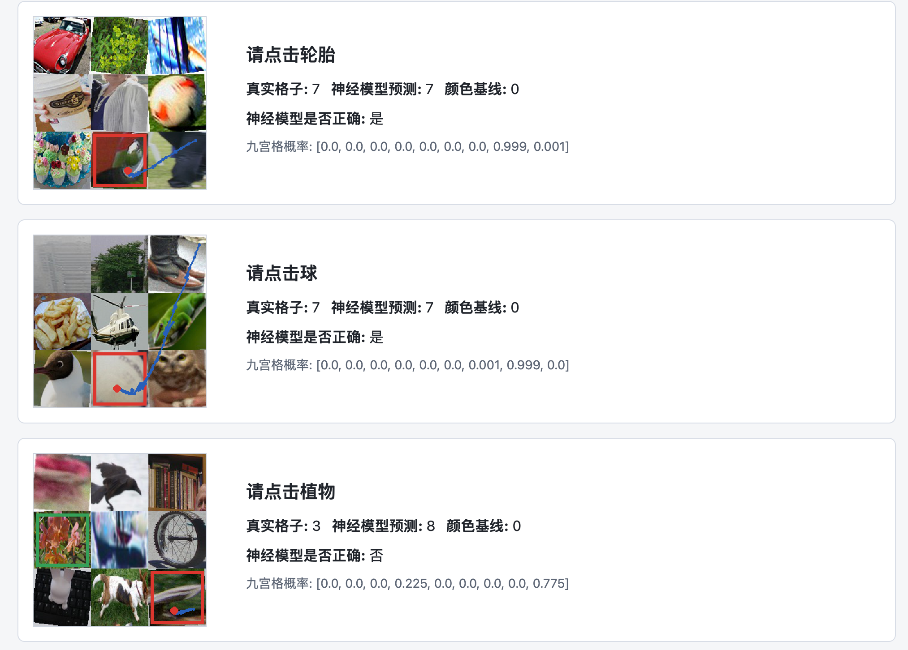

# Multimodal CAPTCHA Project Brief

更新时间：2026-06-06

## 项目目标

本项目目标是构建一个多模态人机验证任务原型：输入一张真实照片拼成的 9 宫格图片，以及一条中文任务描述，例如“请点击披萨”，模型输出目标所在格子，并进一步生成鼠标点击轨迹。

当前阶段重点不是攻击真实验证码系统，而是课程项目中的多模态数据处理、图文对齐、视觉定位和轨迹生成实验。

## 当前数据集

真实照片来源主要来自 Open Images，经物体检测框裁剪后保存到 `data/photo_objects/`。每个类别一个文件夹，例如 `car/`、`dog/`、`pizza/`。

当前照片类别覆盖情况：

- 每类至少 100 张的可用类别：135 / 159
- 九宫格训练数据：`data/photo_grid_100cls/`
- 样本数：10000 条
- 每条样本包含：
  - `image`：9 宫格图片路径
  - `prompt`：中文指令，例如“请点击汽车”
  - `target_index`：目标格子编号，范围 0-8
  - `items`：9 个格子中每个物体的类别和来源图片

数据构建命令：

```bash
python scripts/build_photo_grid_dataset.py \
  --photo-root data/photo_objects \
  --output-dir data/photo_grid_100cls \
  --num-samples 10000 \
  --min-images-per-class 100 \
  --max-classes 120 \
  --hard-augment \
  --progress-every 100
```

`--hard-augment` 会对每个格子里的照片做随机裁剪、旋转、亮度/对比度/颜色扰动、模糊和噪声，以提升泛化能力。

## 数据划分

当前训练和验证是分开的，但还没有独立 test set。

代码默认使用 `train_ratio=0.85`：

- train：前 8500 条
- val：后 1500 条

注意：当前是“九宫格样本级别”划分，不是“原始照片级别”划分。因此同一张原始裁剪照片可能出现在 train 和 val 的不同九宫格组合中。当前验证结果能说明模型对同一照片库的新组合有效，但严格泛化测试还需要按 source 图片划分 train/val/test。

## 当前模型架构

当前训练使用的是：

```bash
--model-size attn
```

主模型类为 `MultimodalGridLocator`，整体结构如下：

```text
输入：
  1. 9 宫格图片
  2. 中文文本指令

文本分支：
  中文字符 token
  -> Embedding
  -> 双向 GRU
  -> text_feat

图像分支：
  9 宫格图片切成 9 个 cell
  -> 每个 cell resize 到 96x96
  -> 残差 CNN 提取每格图像特征
  -> Linear projection

九格上下文建模：
  cell feature + position embedding
  -> 2 层 TransformerEncoder

图文融合：
  对每个格子拼接：
    cell_feat
    text_feat
    cell_feat * text_feat
    abs(cell_feat - text_feat)
  -> MLP
  -> 输出该格子的 logit

输出：
  9 个 logits，argmax 得到目标格子编号 0-8
```

图像 CNN 分支按卷积层计数共 10 个 Conv2d：

- 4 个主干卷积层
- 3 个 ResidualBlock，每个 ResidualBlock 内部 2 个卷积层
- CNN 后接 AdaptiveAvgPool 和 Linear projection

训练时还有一个辅助分类头：

```text
object_head: 对每个格子预测物体类别
```

因此总损失为：

```text
total_loss = grid_location_loss + aux_weight * object_classification_loss
```

当前 `aux_weight = 0.7`。

## 训练流程

本次训练命令：

```bash
python scripts/train.py \
  --data-dir data/photo_grid_100cls \
  --output outputs/photo_model_100cls_attn.pt \
  --epochs 40 \
  --batch-size 64 \
  --lr 0.001 \
  --aux-weight 0.7 \
  --patience 10 \
  --model-size attn \
  --progress-every 20
```

训练配置：

- epochs：40
- batch size：64
- optimizer：AdamW
- scheduler：CosineAnnealingLR
- 主损失：CrossEntropyLoss，预测 9 个格子
- 辅助损失：CrossEntropyLoss，预测每格物体类别
- 设备：当前训练在 CPU 上完成
- 训练日志：`outputs/photo_model_100cls_attn.log.jsonl`
- 模型权重：`outputs/photo_model_100cls_attn.pt`

训练脚本现在会记录 JSONL 日志，包括 batch 进度、loss、ETA、每轮验证准确率和最佳验证准确率。

## 当前训练结果

训练完成后保存的最佳模型：

```text
outputs/photo_model_100cls_attn.pt
```

训练日志最后一轮：

```text
epoch: 40
train loss: 0.9117
val_acc: 0.8220
best_val_acc: 0.8240
```

全量验证集评估结果：

```text
split: val
total: 1500
top-1 accuracy: 82.4%
top-3 accuracy: 96.87%
mean_click_distance: 28.64
median_click_distance: 0.0
failures_saved: 12
```

评估结果文件：

```text
outputs/eval_100cls_attn/model/metrics.json
```

失败案例图片：

```text
outputs/eval_100cls_attn/model/failures/
```

HTML 可视化：

```text
outputs/photo_demo_100cls_model.html
```

重新生成 HTML：

```bash
python scripts/make_demo_html.py \
  --data-dir data/photo_grid_100cls \
  --mode model \
  --checkpoint outputs/photo_model_100cls_attn.pt \
  --output outputs/photo_demo_100cls_model.html \
  --num-examples 12
```

重新评估：

```bash
python scripts/evaluate.py \
  --data-dir data/photo_grid_100cls \
  --mode model \
  --checkpoint outputs/photo_model_100cls_attn.pt \
  --output-dir outputs/eval_100cls_attn \
  --progress-every 100
```

## 结果解读



当前模型已经能在 100 类级别真实照片 9 宫格任务上达到较可用的定位效果。Top-1 为 82.4%，说明第一预测还有一定错误率；Top-3 为 96.87%，说明模型大多数情况下已经把目标排在很靠前的位置。

HTML 中看到若干失败样本是正常现象。以 82.4% 的准确率估计，12 个随机展示样本中出现 2-3 个失败并不异常。

当前主要错误来源：

- 真实照片类别差异大，部分物体被裁剪、遮挡或背景干扰。
- 一些类别视觉上相似，或者目标物体在 cell 中占比很小。
- 当前模型是自训练轻量模型，不是 CLIP/BLIP/LLaVA 这类大规模预训练视觉语言模型。
- 验证集没有按原始 source 图片严格隔离，泛化评估还不够严格。

## 已完成的工程能力

- 自动下载/补齐 Open Images 类别照片
- 按类别裁剪真实物体照片
- 构建真实照片 9 宫格图文数据集
- 构建 harder augmentation 数据
- 训练 CNN + GRU + Transformer 多模态定位模型
- 训练日志 JSONL 记录
- 评估指标输出和失败案例保存
- 静态 HTML 展示模型预测和鼠标轨迹
- 鼠标轨迹已改为随机起点、随机格内落点，带曲线、抖动和末端停顿

## 下一步建议

1. 增加严格 test set：按原始 source 图片划分 train/val/test，避免同一裁剪图同时出现在训练和验证。
2. 增加训练数据量：从 10000 条提升到 30000-50000 条，并保留 hard augmentation。
3. 引入预训练视觉编码器：例如 CLIP/ViT image encoder，提升真实照片泛化能力。
4. 改进文本编码：当前是字符级 Embedding + GRU，可以尝试中文预训练文本编码器。
5. 增加类别均衡采样：避免高频类别主导训练。
6. 加入 top-k 或置信度分析：对低置信样本做失败原因分类。
7. 加训练 resume：保存 latest checkpoint、optimizer 和 scheduler 状态，支持中断后续训。
